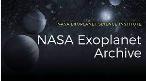

## Table of Contents

* [About the Project](#about-the-project)
* [Roadmap](#roadmap)
* [Contributing](#contributing)
* [License](#license)
* [Contact](#contact)

## About The Project

Since 1992 over 4,000 exoplanets have been discovered outside our solar system. The United States National Aeronautics and Space Administration (NASA) maintains a publicly accessible archive of the data collected on these in comma separated value (CSV) format.

The objective of the NASA Exoplanet Query app is to make this data available for simple queries by its users.
Requirements & Constraints

    The Developer should implement a means of efficiently loading the exoplanet CSV data obtained from NASA to minimize any delays when the application starts.
    Similarly, the Developer should utilize a data structure and search mechanism that minimizes the time required to query the exoplanet data and display the results.
    The Developer will need to review the Exoplanet Archive documentation to understand the format of the data fields.

The project comes from [florinpop17](https://github.com/florinpop17/app-ideas/blob/master/Projects/3-Advanced/NASA-Exoplanet-Query.md)

## Roadmap

See the [open issues](https://github.com/remi-boivin/NASA-exoplanet-query/issues) for a list of proposed features (and known issues).
## License

The project is under GNU v3 Licence. For more informations you can read the  [LICENCE.md](https://github.com/remi-boivin/NASA-exoplanet-query/blob/master/LICENSE) for more information about the MIT licence.

## Contact

[remi-boivin](https://github.com/remi-boivin) - [E-Mail](mailto:remi.boivin@epitech.eu)
